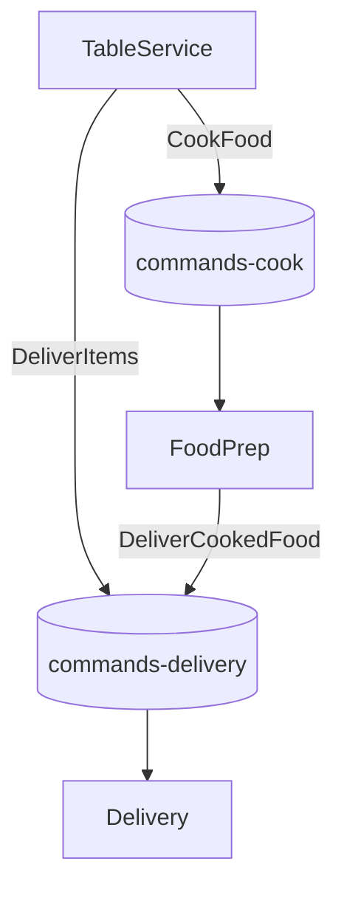
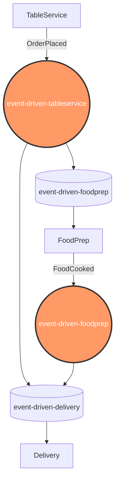
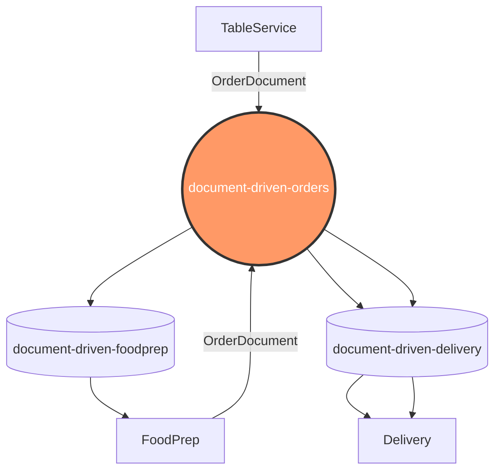
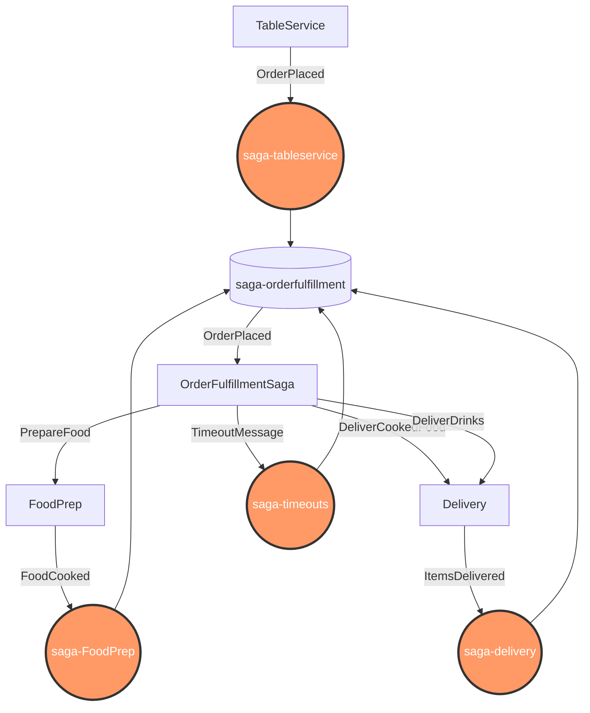

# Different approaches

Visualizations of the different event types with different topologies used in the example.
It mimics the communication between *Table Service*, *Food Preparation* and *Delivery* as outlined in the [Restaurant Kata](https://github.com/Nagelfar/RestaurantKata).
All variations are implemented with the same two parts:

- OpenAPI driven controllers to create a HTTP request for an order, which will produce a message
- RabbitMQ based subscribers for Food Preparation and Delivery that react on messages

## Starting the Application

### Running RabbitMQ

For all examples except the saga the following configuration for RabbitMQ is sufficient:

    docker run -d \
        --hostname messagesample-rabbit \
        --name messagesample-rabbit \
        -p 5672:5672 \
        -p 15672:15672 \
        rabbitmq:3-management

For the **Saga** example the [Delayed Messaging Plugin](https://github.com/rabbitmq/rabbitmq-delayed-message-exchange) of Rabbit MQ is needed and provided by the `broker/Dockerfile`.

    docker build broker -t broker
    docker run -d \
        --hostname messagesample-rabbit-delayed \
        --name messagesample-rabbit-delayed \
        -p 5672:5672 \
        -p 15672:15672 \
        broker

Note: the default user `guest` and password `guest` should be sufficient and the management UI can be used for introspection

### Running the Application

Then build the application

    dotnet build

Now start the OpenAPI based web application

    ASPNETCORE_ENVIRONMENT=Development Controllers=true Consumers=false ASPNETCORE_URLS=http://+:5048 \
        dotnet run \
            --no-build \
            --no-launch-profile

Lastly start one or several consumers (mind the ports!)

    ASPNETCORE_ENVIRONMENT=Development Controllers=false Consumers=true ASPNETCORE_URLS=http://+:8001 \
        dotnet run \
            --no-build \
            --no-launch-profile

## Visualizations of the topologies & communication

### Command-based

### Event Based

### Document Based

### Saga Based

