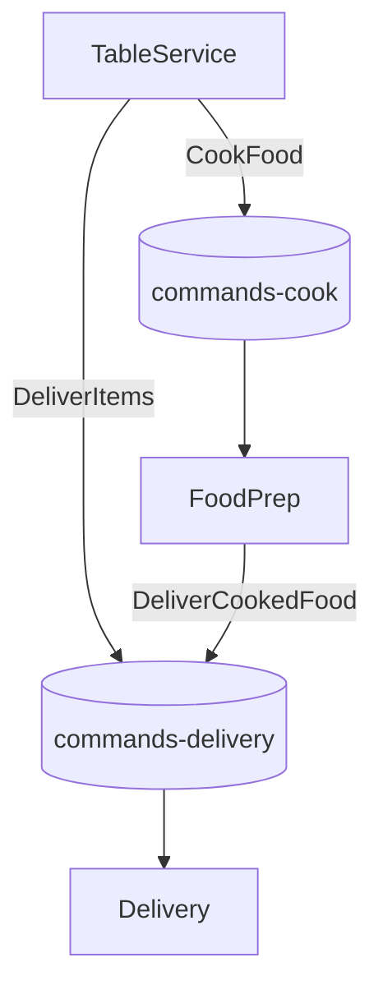
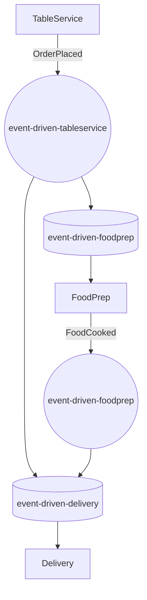
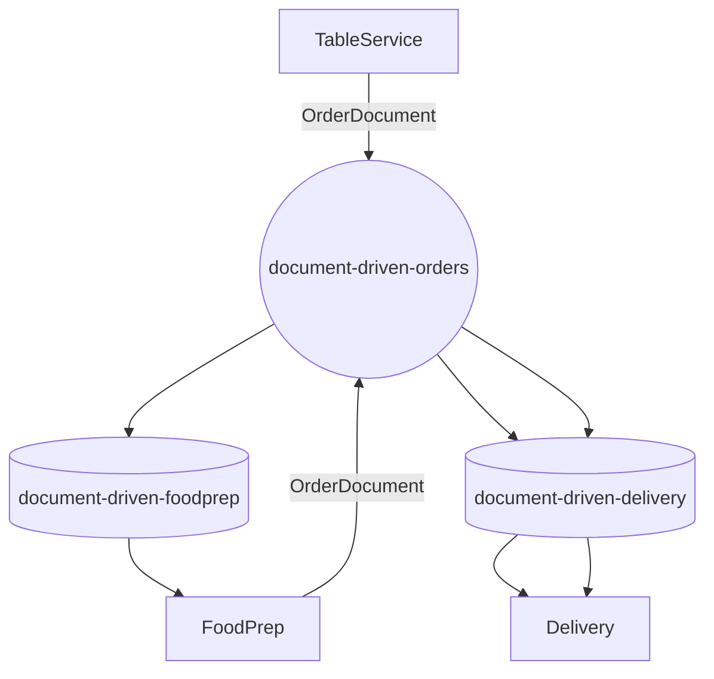

# Different approaches

## Naive Command-based

```mermaid
graph TD
    A[TableService] -->|CookFood| cc[(commands-cook)] --> F[FoodPrep]
    A --> |DeliverItems| cd[(commands-delivery)] --> D[Delivery]
    F --> |DeliverCookedFood| cd 
```

## Event Based

```mermaid
graph TD
    A[TableService] -->|OrderPlaced| tt((event-driven-tableservice))
    tt --> qfp[(event-driven-foodprep)] --> F[FoodPrep]
    tt --> qd[(event-driven-delivery)]  --> D[Delivery]
    F --> |FoodCooked| tfp((event-driven-foodprep)) --> qd
```

## Document Based

```mermaid
graph TD
    A[TableService] -->|OrderDocument| to((document-driven-orders))
    to --> qfp[(document-driven-foodprep)] --> F[FoodPrep]
    to --> qd[(document-driven-delivery)]  --> D[Delivery]
    F --> |OrderDocument| to --> qd --> D
``` 