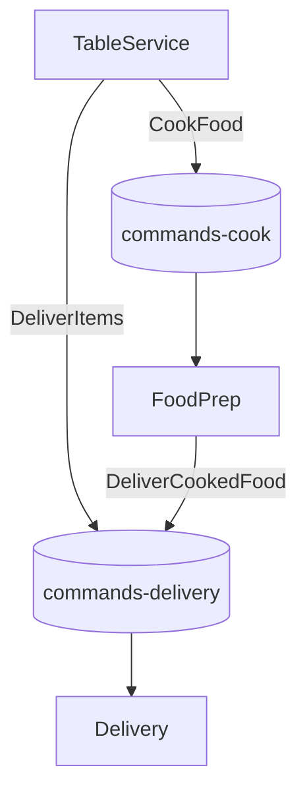

# Different approaches

# Naive Command-based

```mermaid
graph TD
    A[TableService] -->|CookFood| cc[(commands-cook)] --> F[FoodPrep]
    A --> |DeliverItems| cd[(commands-delivery)] --> D[Delivery]
    F --> |DeliverCookedFood| cd 
```